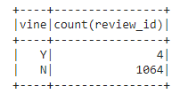
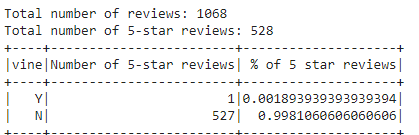
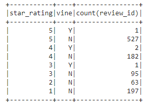

# Amazon Vine Program Analysis
## Overview

The following analysis is made with the purpose of determining wether there is a positivity bias in the Vine service provided by Amazon in the way of favorable or positive reviews towards a product.

We decided to use the *Mobile Electronics* dataset. After filtering the reviews for those that matched our criteria. We were left with about **1000** reviews to analyze, so we consider it a reasonably large set. 

## Results

After running our analysis, we amassed the following results:

- We had a total of **1068** reviews. Out of which **4** were Vine Reviews and **1064** were non-Vine reviews.

- Out of the **1068** reviews, **528** were 5-star reviews, and out of those **527** were non-Vine reviews, with a *single* item being a 5-star Vine review.

- This means ***99.81%*** of 5-star reviews are attributed to non-Vine users. Leaving a remaining ***0.19%*** for Vine users.

## Summary

Thanks to our result we may conclude that there is ***no*** significant favorable bias towards positive reviews through the Vine program, the percentage of total Vine reviews do not have enough pull to skew the overall review of a product.

One further analysis to run, would be to see the distribution of Vine and non-Vine reviews accross all star ratings, as seen below:

We can note that, even though the Vine program seems to provide reviews on the upper end of ratings. There seems to be little evidence that they skewer the data in a favorable way. 

However, wether or not a definite conclusion is reached regarding the impact and bias of Vine reviewers needs to be answer when there are a significant ammount of reviewers that may sway the data in a more significant way. As of now, with the data given, there seems to be no favorable sway due to Vine Program reviewers.